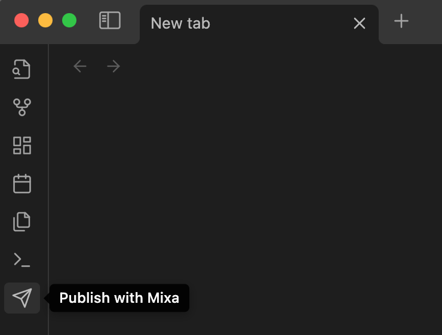

# Mixa
Mixa is a 1-click no-code site builder with tons of features for you to share your notes and blog posts in seconds.

- [Mixa](https://mixa.site)
- [Docs](https://docs.mixa.site)
- [Roadmap](https://trello.com/b/UG0i4eJR/mixa-roadmap)
- [Discord](https://discord.com/invite/z3xNMHjUt7)
- [Community](https://mixasite.talkyard.net/)
- [Email support@mixa.site](mailto:support@mixa.site)

## Release notes
### 1.0.1
- Now you can see what is going to be published by clicking "Show Changes" Button in the plugin settings page. It will show which files will be published and which ones are deleted. If all looks good, you can click "Publish" to publish your changes with peace of mind
- You can disable publishing individual files by adding `draft: true` frontmatter 
```
---
draft: true
---

Some note that will not be published till draft frontmatter is removed or changed to false
```


## Mixa Demo
### With Obsidian
[](https://youtu.be/FrvZd2pdX-g)

### With .zip file
[](https://youtu.be/-Ylp5Dm9sVo)

## How to use
1. Login to the [mixa.site](https://mixa.site)
2. Create a new site from the dashboard
3. Generate a secret token from the site settings in the dashboard
4. Paste the token in Obsidian Mixa plugin and Publish your site
5. Once you setup your Obsidian-Mixa integration, you can also use the publish button and publish your changes in 1-click


## You focus on your content, we take care of the rest
Create a blazing-fast, beautiful website with great SEO under your own domain. Bring your notes or blog posts and publish in seconds. Enable the features you need using the live-preview editor. No coding is needed. Use your favorite tool to write like Obisidian.

### 1-Click Publish
- Zero-code, no-hassle publishing
- Notes and Blogs are first-class citizens
- Create your pages in md, mdx, or html
- Keep your folder/file structure however you want

### Looks good everyway
- 30 themes to choose from
- Mobile-first design
- Beautiful subdomain or bring your custom domain

### Blazing fast
- Your site is stored all over the world for faster load time
- Images are optimized for faster load too
- Your site is optimized for SEO

### All-In-One Solution
- Fully customizable site with live preview.
- Sidebar navigation
- Header navigation
- Site search
- Table of contents
- Google Analytics
- Light/Dark mode switcher
- Inject your custom JavaScript and CSS